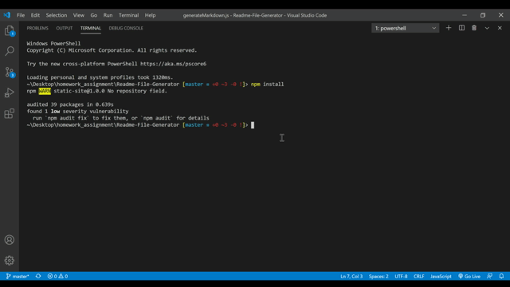

  
# Google-Books-Search

## Description 
The purpose of this project was to allow users to search for books, view the information and then save their favorite books. 

## Project Demonstration
  

## Table of contents

- [Description](#description)
- [Installation](#installation)
- [Usage](#usage)
- [License](#license)
- [Contributing](#contributing)
- [Questions](#questions)
- [Repository Link](#repository)

## Installation

        N/A

## Usage

        Please navigate to the Heroku Link > https://google-books-kj.herokuapp.com/

## License
MIT 

 

## Contributing

The owner of this project is KJ-Labs, you're welcome to contribute.

## Questions

- If you have any questions, please contact me on Github.
- [KJ-Labs](https://github.com/KJ-Labs)

## Repository

- [Project Repo](https://github.com/KJ-Labs/Google-Books-Search)

## Screenshots
  

